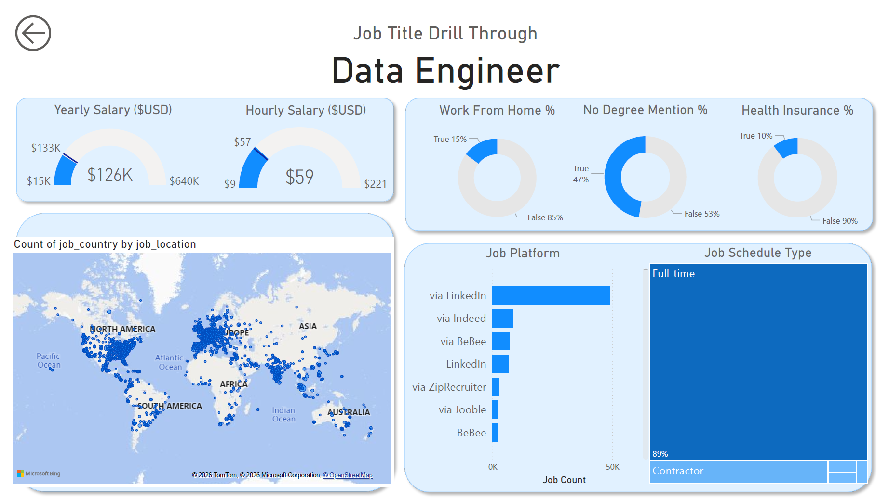

# Data Jobs Dashboard with Power BI

> <a href="PUT_YOUR_POWER_BI_LINK_HERE" target="_blank">📊 View interactive dashboard on the Power BI Service</a>

---

## 📝 Project Overview

The **Data Jobs Dashboard** helps **job seekers, career switchers, and data enthusiasts** explore the 2024 data job market.  
It consolidates real-world job postings: **job titles, salaries, locations, and key skills**, providing clear insights into market trends and compensation patterns.

**Key Highlights:**
- Identify top-paying roles and in-demand skills
- Compare salary ranges across job titles
- Visualize global job distribution with interactive maps

---

## 📂 Dashboard File
You can download and explore the Power BI dashboard here:  
[`Data_Jobs_Dashboard.pbix`](Data_Jobs_Dashboard.pbix)  

---

## 🛠️ Skills Demonstrated

- **Data Transformation (ETL) with Power Query**: Cleaned and prepared datasets for analysis  
- **Implicit Measures & KPIs**: Calculated Median Salary, Job Count, and key metrics  
- **Visualizations**: Column, Bar, Line, Area, and Map charts  
- **Interactive Dashboards**: Slicers, Buttons, Bookmarks, and Drill-Through pages  
- **Dashboard Design**: Clean and intuitive layout for professional presentation

---

## 📊 Dashboard Preview

### Page 1: Overview & High-Level Market View

**Key KPIs:** Total job count, median salaries, and top job titles.

---

### Page 2: Job Title Drill-Through

Shows details for a single job title: salary ranges, remote work stats, top hiring platforms, and global job locations.

---

## 📈 Conclusion

This dashboard transforms raw job posting data into a **powerful career insights tool**, helping users make informed decisions about their data analytics career paths.

---

## 🔗 Connect with Me

- **LinkedIn**: [Goda Emad](https://www.linkedin.com/in/goda-emad/)  
- **GitHub**: [Goda-Emad](https://github.com/Goda-Emad)  
- **Email**: goda.emade2001@gmail.com

---

## 🏷️ Notes

- Replace `PUT_YOUR_POWER_BI_LINK_HERE` with your live Power BI Service link (if available)  
- Ensure all images are uploaded to the `Resources/` folder  
- Badge links can be customized as needed
